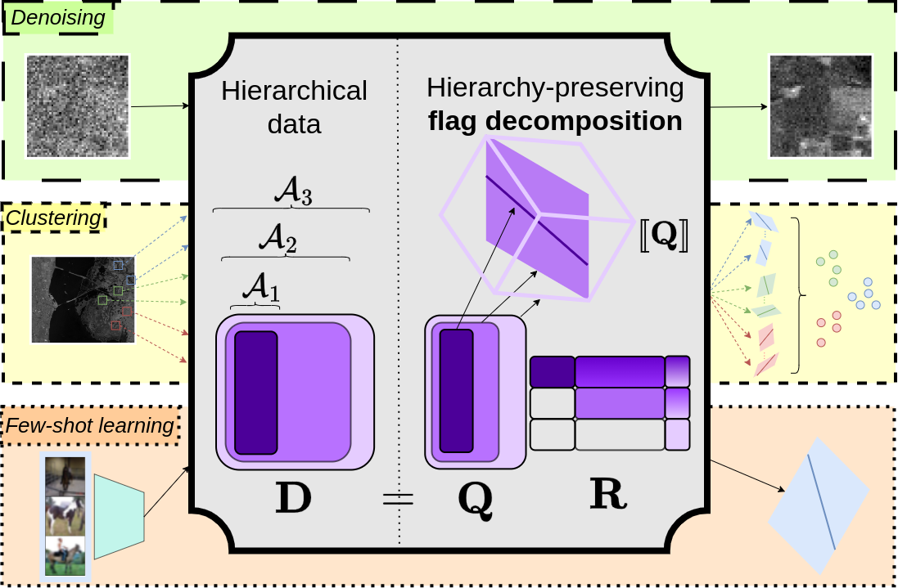

# A Flag Decomposition for Hierarchical Data Sets




## Abstract
Flag manifolds encode hierarchical nested sequences of subspaces and serve as powerful structures for various computer vision and machine learning applications. Despite their utility in tasks such as dimensionality reduction, motion averaging, and subspace clustering, current applications are often restricted to extracting flags using common matrix decomposition methods like the singular value decomposition. Here, we address the need for a general algorithm to factorize and work with hierarchical datasets. In particular, we propose a novel, flag-based method that decomposes arbitrary hierarchical real-valued data into a hierarchy-preserving flag representation in Stiefel coordinates. Our work harnesses the potential of flag manifolds in applications including denoising, clustering, and few-shot learning.

## Manuscript
* [arXiv](https://arxiv.org/abs/2502.07782)
* [CVPR proceedings](https://openaccess.thecvf.com/content/CVPR2025/papers/Mankovich_A_Flag_Decomposition_for_Hierarchical_Datasets_CVPR_2025_paper.pdf)
* [Supplementary material](https://openaccess.thecvf.com/content/CVPR2025/supplemental/Mankovich_A_Flag_Decomposition_CVPR_2025_supplemental.pdf)

## How to Cite
```Bibtex
@InProceedings{Mankovich_2025_CVPR,
    author    = {Mankovich, Nathan and Santamaria, Ignacio and Camps-Valls, Gustau and Birdal, Tolga},
    title     = {A Flag Decomposition for Hierarchical Datasets},
    booktitle = {Proceedings of the Computer Vision and Pattern Recognition Conference (CVPR)},
    month     = {June},
    year      = {2025},
    pages     = {18738-18748}
}
```


## Quick Start
1. Install [anaconda](https://www.anaconda.com/download) or [miniconda](https://docs.anaconda.com/free/miniconda/index.html)

1. Initialize conda environment
    ```
    conda env create -f flag_decomp.yml
    conda activate flag_decomp
    ```

1. Visit getting_started.ipynb for an introduction to flag decompoisitions for flag recovery and denoising


## Authors

Nathan Mankovich, Ignacio Santamaria, Gustau Camps-Valls, and Tolga Birdal

